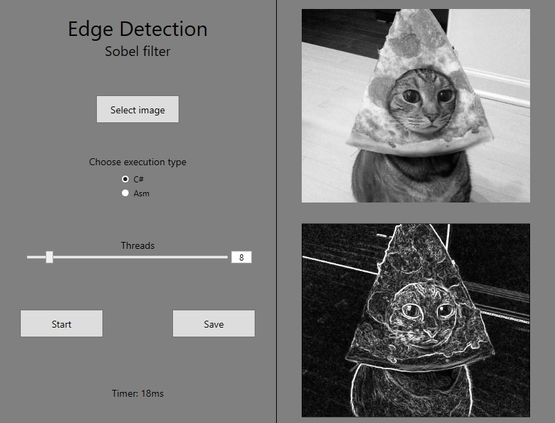

# Edge detection - Sobel Filter

Tool for detecting edges in an image using the Sobel filter. Created as a project at the university. Operations performed on the image are implemented in C# and ASM.

## Sample

## Interface

## Usage

Program uses one of the two included DLL libraries  (C# / ASM) to perform operations. The user can switch between them using the radio buttons. The program supports multithreading, the user can use the slider to define the number of threads used (default value = number of threads supported by the processor). 

>Note: due to the way the calculations are performed, edge pixels are not considered

## C#
The function in C# uses pointers to perform operations on an image. This method is slightly faster than Marshal.Copy, and much faster than GetPixel/SetPixel.

## ASM
The function in ASM makes use of XMM register - each pixel is divided into RGBA values and then goes to one of the XMM registers, where it undergoes further calculations.

